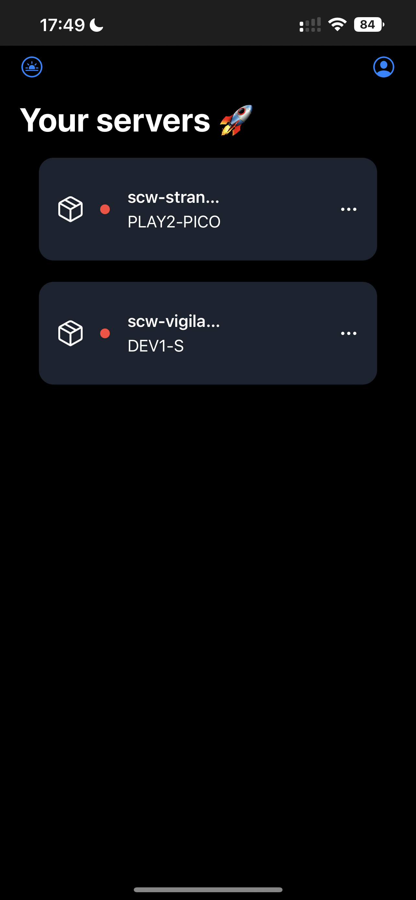
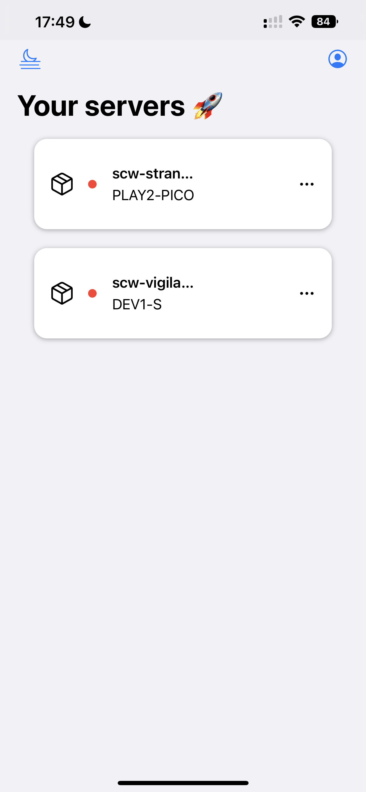
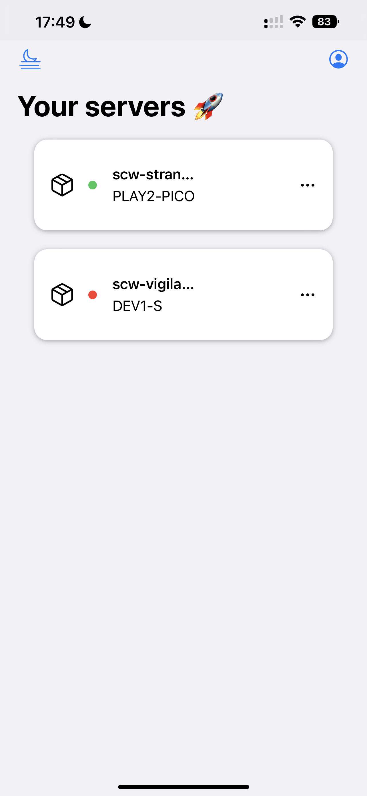
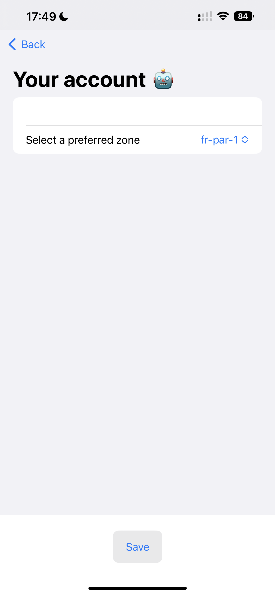
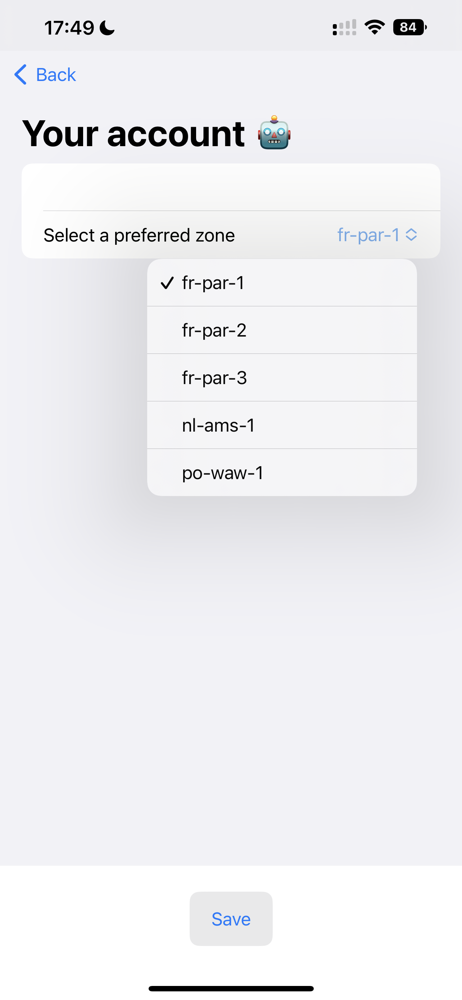
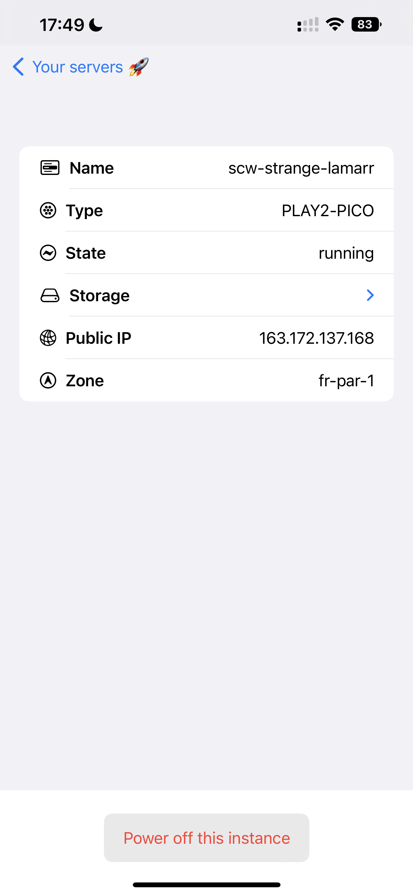
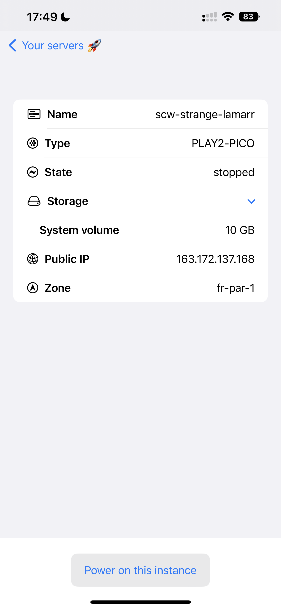
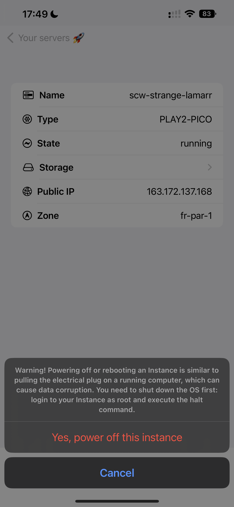

# CSC-780 Final Term Project

This repository contains the sources for the CSC-780 final term project.

## Description

The project consists of an iOS application that can run on any iOS compatible device, but is mostly targeting iPhones.

The application can be used to monitor a user's instances run on Scaleway, a French cloud-provider.
The user, once logged in, can retrieve the running instances he/she has for a given geographical zone and power up/off
the said instance.

## Proposal

Below is a list of proposed features for the project.
It is also used to track implementation status for those.

- [x] The user must be able to fill his API Key in a configuration view.
- [x] The user's API Key must be stored in the Apple Keychain.
- [x] The user's API Key must load every time he opens the configuration view.
- [x] The user must be able to select its preferred zone in the configuration view.
- [x] The user's preferred zone must load every time he opens the configuration view.
- [x] The user's instances should be loaded in a list on the main view.
- [x] The user must be able to refresh the list of instances in the main view.
- [x] The user must be able to see the details of a specific instance in a dedicated view.
- [x] The user must be able to power off and power on any instance from the detailed view.
- [x] The user must be able to change the color theme from light to dark in the main view.
- [x] If any error occur at any point (saving the API Key in the Apple Keychain or while interacting with the Scaleway's 
API), an alert should appear and tell the user what happened.
- [x] The instances list should be refreshed at a regular interval.

## Build

To build the project, you must have a Mac with XCode installed.
Clone the project and open it in the editor.

Then, build the application and run it in the iPhone simulator.
Fill your API Key in the account view. Come back to the main view, and your instances should have appeared, assuming
that you have created one or more on the [Scaleway Elements Dashboard](https://console.scaleway.com/login/).

## Visuals

Below are a few visuals of the application, along with their corresponding description.

### Main view in dark color theme.

  

### Main view in light color theme.

  

### Main view with an instance powering on.

  

### Main view with an instance powered on.

  

### Account view.

  

### Account view with zone selection.

  

### Instance view with instance details.

  

### Instance view with instance details and volume list opened.

  

### Instance view with confirmation before powering off.

  

